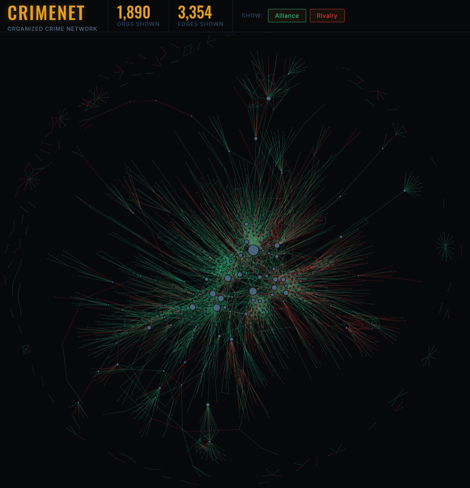

# CRIMENET — Global Criminal Network Database

Open-source database and interactive visualization of alliances and rivalries between criminal organizations worldwide, extracted from Wikipedia with an LLM pipeline.

**1,173 organizations. 2,765 relationships. 737 source articles.**

- Live visualization: <a href="https://www.alvarofrancomartins.com/crimenet" target="_blank">alvarofrancomartins.com/crimenet</a>

<p align="center">
  <a href="https://www.alvarofrancomartins.com/crimenet">
    
  </a>
</p>

## Repository layout

```
.
├── 0_urls_to_articles.py      # Step 0: page_hyperlinks.csv → articles.csv
├── 1_fetch_wikipedia.py       # Step 1: Wikipedia text + infobox → txts/
├── 2_extract_network.py       # Step 2: LLM extraction → txts/<slug>/extracted.json
├── 3_merge_network.py         # Step 3: merge per-article JSONs → global_network.json
├── 4_cleanup_and_prepare.py   # Step 4: cleanup + centrality → crimenet_specific.json
├── index.html                 # D3.js force-directed visualization
├── page_hyperlinks.csv        # Input: one Wikipedia URL per row
├── articles.csv               # Generated: title, folder_name, versioned URL
├── global_network.json        # Raw merged network (pre-cleanup)
├── crimenet_specific.json     # Final network (alliance/rivalry, cleaned)
├── deepseek_api_key.txt       # API key (not committed)
├── txts/                      # One folder per article (content.txt, url.txt, extracted.json)
├── notebooks/                 # Analysis notebooks for the report
└── README.md
```

## Pipeline

Run the five numbered scripts in order. 

```bash
python 0_urls_to_articles.py --input page_hyperlinks.csv --output articles.csv
python 1_fetch_wikipedia.py --csv articles.csv --output ./txts
python 2_extract_network.py --dir ./txts
python 3_merge_network.py --dir ./txts --output global_network.json --stats
python 4_cleanup_and_prepare.py --input global_network.json --stats
```

### Step 0: URLs → `articles.csv`

`0_urls_to_articles.py` reads a list of plain Wikipedia URLs from `page_hyperlinks.csv` (one URL per row), queries the Wikipedia API for the current revision ID of each, and writes `articles.csv` with title, folder name, and versioned URL (`?oldid=...`).

`page_hyperlinks.csv` format:

```csv
url
https://en.wikipedia.org/wiki/'Ndrangheta
https://en.wikipedia.org/wiki/Sinaloa_Cartel
https://it.wikipedia.org/wiki/Cosa_nostra
```

Both English and Italian Wikipedia URLs are supported. Language is detected from the domain.

### Step 1: Fetch Wikipedia text → `txts/`

`1_fetch_wikipedia.py` reads `articles.csv` and, for each article, fetches:

- Clean article text via the Wikipedia API.
- Infobox HTML, parsed with BeautifulSoup (aliases, allies, rivals, years active), appended to the article text as key-value pairs.

Writes `txts/<slug>/content.txt` and `txts/<slug>/url.txt`. Resumes automatically. Use `--force` to re-fetch all.

### Step 2: LLM extraction → `txts/<slug>/extracted.json`

Add a DeepSeek API key in deepseek_api_key.txt in the project root.

`2_extract_network.py` sends each article to the DeepSeek API with a structured prompt enforcing a strict output schema. Extracts:

- **Nodes**: standardized name, aliases, type, context, time period.
- **Edges**: source, target, relationship type (`alliance`, `rivalry`, or `other`), optional detail, context, time period.

Articles longer than 3,000 words are chunked, with the article's opening paragraph passed as context to every chunk. Runs in parallel across 50 workers. Outputs `extracted.json` in each article's folder.

- `--force`: re-extract everything.
- `--force-failed`: retry only folders with missing or broken `extracted.json`.

### Step 3: Merge → `global_network.json`

`3_merge_network.py` combines all `extracted.json` files into a single `global_network.json`. Nodes are deduplicated by name (case-insensitive), with aliases, descriptions, and source references merged across duplicates. Edges are deduplicated by `(source, target, relationship, detail)`. Every node and edge is tagged with the source article's versioned Wikipedia URL.

### Step 4: Cleanup → `crimenet_specific.json`

`4_cleanup_and_prepare.py` applies:

- **Type consolidation**: 60+ LLM-generated organization types are mapped to 9 canonical ones: gang, mafia, cartel, clan, motorcycle club, triad, militia, faction, terrorist organization.
- **Relationship sanitization**: invalid or hallucinated relationship values are corrected; "other" edges whose detail matches alliance/rivalry language (e.g., "collaboration", "conflict") are reclassified to the correct type.
- **Deduplication**: a curated dictionary maps known variant spellings to their canonical name (e.g., "Medellin Cartel" → "Medellín Cartel", "FARC-EP" → "FARC"). No fuzzy matching.
- **Generic node filtering**: umbrella terms ("Russian organized crime", "Colombian drug cartels") are removed; specific organizations with similar names are preserved via a safelist.
- **Defunct filtering**: organizations with documented dissolution dates and no evidence of continued activity are excluded.
- **Source URL splitting**: each organization's URLs are split into "own source" (the page about the organization) and "mentioned in" (other articles referencing it).
- **Betweenness centrality**: computed three ways (alliance-only, rivalry-only, combined) using NetworkX, so the visualization can resize nodes correctly for each filter.

Outputs `crimenet_specific.json` (full network).

### Visualize

```bash
python -m http.server 8000
```

Then open [http://localhost:8000/index.html](http://localhost:8000/index.html). `index.html` expects `crimenet_specific.json` in the same folder. The D3.js graph supports alliance/rivalry filtering, search by organization (dropdown ranked by betweenness), neighbor isolation on click, a side panel with organization details and edge evidence, and adjustable force parameters.
